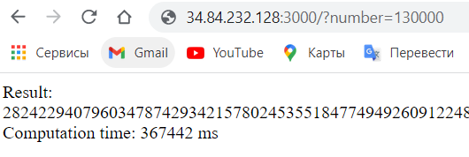
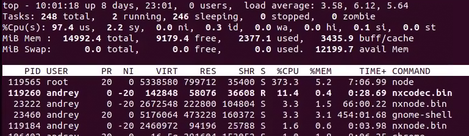

Программа предназачена для вычисления факториала

Для ее работы нужно перейти по ссылке http://34.84.232.128:3000 и указать в качестве параметра "number", после этого начнется подсчет факториала. Для того чтобы программа выполнялась на протяжении 5-10 минут нужно указать число из промежутка 120000-135000

Пример (Время выполения займет от 5 до 10 минут): 
    http://34.84.232.128:3000/?number=130000
    

Результаты загрузки ресурсов при вычислении факторила

